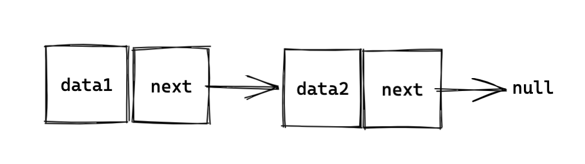
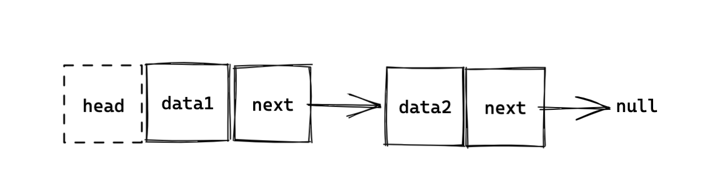
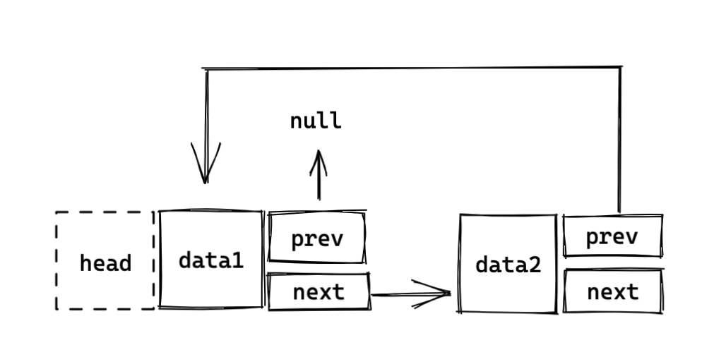
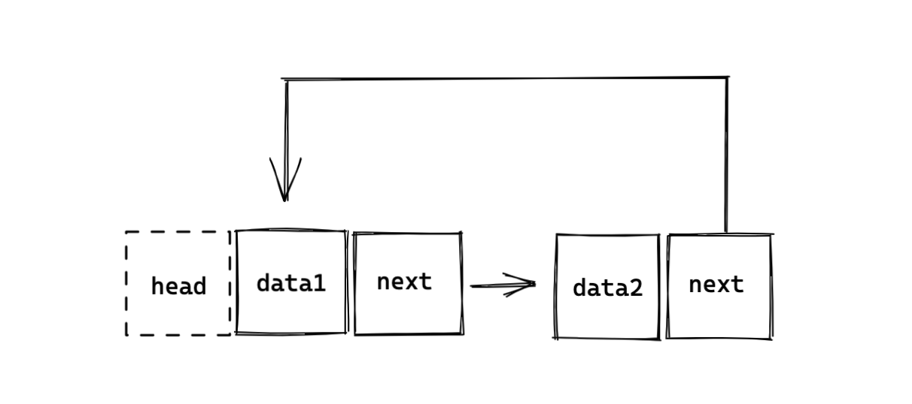

# 链表

> 在计算机科学中, 一个 链表 是数据元素的线性集合, 元素的线性顺序不是由它们在内存中的物理位置给出的。 相反, 每个元素指向下一个元素。它是由一组节点组成的数据结构,这些节点一起,表示序列。

简单的说， 链表由无数个节点组成，而节点=当前节点内容+下一个节点，当到了结尾，下一个节点指向null空指针。

## 分类

### 单向链表
一般为了标识链表的头部，会在第一个节点加上`head`标识：

### 双向链表

> 在计算机科学中, 一个 双向链表(doubly linked list) 是由一组称为节点的顺序链接记录组成的链接数据结构。每个节点包含两个字段，称为链接，它们是对节点序列中上一个节点和下一个节点的引用。开始节点和结束节点的上一个链接和下一个链接分别指向某种终止节点，通常是前哨节点或null，以方便遍历列表。如果只有一个前哨节点，则列表通过前哨节点循环链接。它可以被概念化为两个由相同数据项组成的单链表，但顺序相反。

### 循环链表
循环链表同时又可以区分为 单向循环链表、双向循环链表

## 优缺点

- 优点：适合动态插入和删除的应用场景 

- 缺点：不能快速的定位和随机访问数据

## 应用场景（非前端）

从网上搜索来的几种应用场景：

> - LRU 缓存淘汰算法。
> - 各类缓冲池 和 栈 的实现。
> - 使用链接来解决哈希冲突的哈希表。
> - 简单的内存分配器。
> - FAT文件系统中大文件的元数据。

基本上，前端都没有场景可以应用到链表数据结构，所以很多时候前端开发者学习链表

## 代码实现
在JavaScript，并没有直接以链表为结构的数据类型，所以如果我们要在JavaScript实现一个链表，需要自己去实现。

一个完整链表结构`LinkNode` 包括几块：
1. 属性：节点内容+下一个节点指向`next`
2. 方法：新增、删除等方法

### 单向链表

[include](./code/linklist1.js)

### 双向链表

相比较单向链表，多了一个指向前者对象 `prev`。

[include](./code/linklist2.js) 

### 循环链表

循环链表对比之前，会把最后一个节点的`netx`指向第一个节点， 第一个节点的`prev`指向最后一个节点

[include](./code/linklist3.js)  

