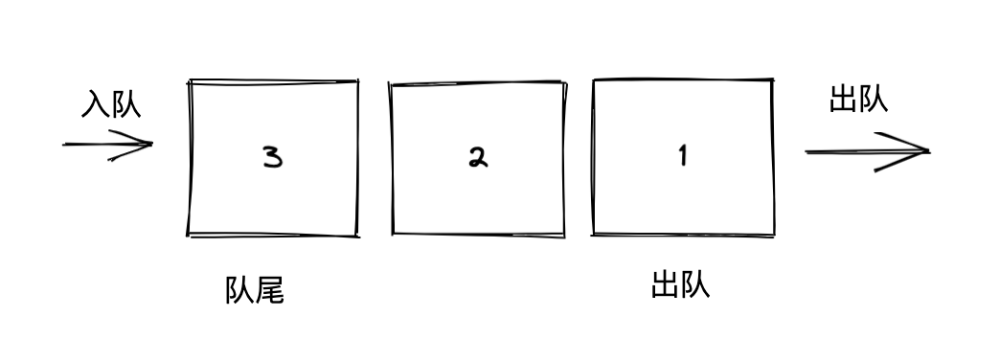

# 队列

> 在计算机科学中, 一个 队列(queue) 是一种特殊类型的抽象数据类型或集合。集合中的实体按顺序保存。
> 队列基本操作有两种：入队和出队。从队列的后端位置添加实体，称为入队；从队列的前端位置移除实体，称为出队。
> 队列中元素先进先出 FIFO (first in, first out)的示意。

队列，其实在我们生活中经常遇到，就比如排队，遵循先进先出规则，就是一种队列，只有排在最前面的人出去了，后面的人才能起来。

这就是队列数据结构的一种限制，并没有像链表那样可以自由插入任一节点，但是有队列数据结构同样可以很好处理各种排队应用场景，比如消息、消费队列等。

下面通过一张图，快速了解一下队列。

一个完整的队列应该包含以下几个点：

- 队头，指的是队列最前面一个，出数据的第一个数据元素
- 队尾，指的排在队列最后一个，进数据的最后一个数据元素
- 入队，指的数据元素进入队列的过程
- 出队，指的数据氧元素出队列的过程

按照各种常见的队列更加深入了解一下。

## 顺序队列

顺序队列是一种我们最常见的队列类型，一般是采用语言本身自带`数组`的数据类型去实现的，实现步骤如下：

- 初始化一个长度为`n`的数组
- 创建两个变量指针`front`和`rear`，其中`front`用来标识队头，`rear`用来标识队尾
- 移动`front`和`rear`，进行入队和出队操作，入队，则将`rear`+1指向新入队列的元素，出队则将`front`+1往后移动
- 如果`front`===`rear`则代表队列已空，无法完成出队操作
- 如果`rear`===`n`则代表队列已满，无法完成入队操作

具体代码如下：

[include](./code/queue1.js)

### 循环队列

循环队列是基于顺序队列做的调整，主要是为了能更好利用顺序队列已清空的元素空间，此时队列的结束位置不再是最后一个位置，允许循环指向开头位置，直到所有队列位置都填满。实现步骤，只需要调整顺序队列的入队操作：

- 入队操作，当`rear`位置达到队列最大长度时候，将`rear`重新指向开始位置0
- 当开始位置已被占用，则表示队列已满

具体代码如下：

[include](./code/queue3.js)

## 链式队列

链式队列与顺序队列是一样的，但是底层是采用`链表`数据结构去实现，实现步骤如下：

- 声明一个空的`链表`节点作为`front`，同时`rear`节点的指向空的`链表`
- 入队操作，新建一个链表节点`node`，先将`rear.next`指向新的链表节点`node`，然后将`rear`=`node`
- 出队操作，先将`front.next`取出，然后再将`front.next`指向`front.next.next`即可
- 如果`front.next`为空，则无法完成出队操作，表示队列为空
- 因为是链表结构，可以无限添加节点且不占用任何空间，如果要限制队列大小，可以在入队的时候增加链表长度限制

具体代码如下：

[include](./code/queue2.js)

## 优先队列

优先队列（priority Queue）是一种特殊的队列，不遵守`先进先出`的原则，它是按照`优先级`出队列的。分为`最大优先队列`（是指最大的元素优先出队）和`最小优先队列`（是指最小的元素优先出队）。实现步骤如下：

一般用`堆`数据结构来实现`优先队列`，在后面讲`堆`的文章里我会详细再讲，这里了解一下即可。

# 额外话题

问题：JavaScript中 数组 Array到底算不算一种队列？

答案：JavaScript中的数组是属于队列的一种， 因为数组本身就是支持队列几种特性，对头，队尾，支持入队push，出队unshift，按照队列定义数组应该是属于队列。

但是由于数组在底层上是属于顺序表，内存地址必须是连续的，因此在入队和出队所需的时间复杂度是成线性，大量需要入队出队操作不建议使用数组作为队列使用。

对比一下，链表也是属于线性表的一种，但是它支持内存地址不需要连续的，因此有中对列类型叫链表队列，可以很好解决大量入队出队操作的场景。

# 参考资料

[算法一看就懂之「 队列 」](https://zhuanlan.zhihu.com/p/81018602)

[维基百科-队列](https://zh.m.wikipedia.org/zh-hans/%E9%98%9F%E5%88%97)