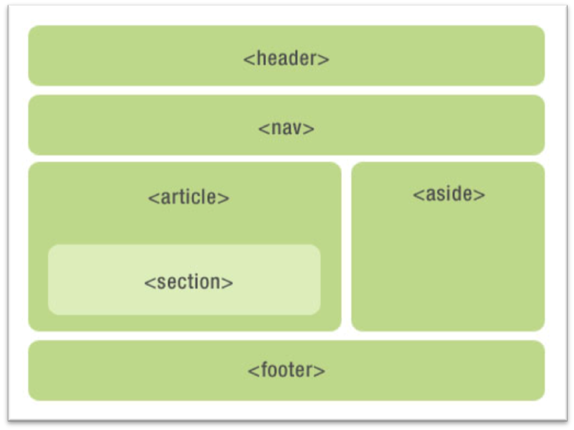

# 1 html语义化
## 1.1 什么是html语义化
基本上都是围绕着几个主要的标签，像标题（H1~H6）、列表（li）、强调（strong em）等等。
根据内容的结构化（内容语义化），选择合适的标签（代码语义化）便于开发者阅读和写出更优雅的代码的同时让浏览器的爬虫和机器很好地解析。
## 1.2 为什么要语义化？
为了在没有CSS的情况下，页面也能呈现出很好地内容结构、代码结构:
- 为了裸奔时好看，当你的css没有加载完成的时候用户看到第一眼就是纯粹的裸奔页面😂；
- 用户体验：例如title、alt用于解释名词或解释图片信息、label标签的活用；
- 有利于SEO：和搜索引擎建立良好沟通，有助于爬虫抓取更多的有效信息：爬虫依赖于标签来确定上下文和各个关键字的权重；
- 方便其他设备解析（如屏幕阅读器、盲人阅读器、移动设备）以意义的方式来渲染网页；
- 便于团队开发和维护，语义化更具可读性，遵循W3C标准的团队都遵循这个标准，可以减少差异化。

## 1.3 写HTML代码时应注意什么？

- 尽可能少的使用无语义的标签div和span；
- 在语义不明显时，既可以使用div或者p时，尽量用p, 因为p在默认情况下有上下间距，对兼容特殊终端有利；
- 不要使用纯样式标签，如：b、font、u等，改用css设置。
- 需要强调的文本，可以包含在strong或者em标签中（浏览器预设样式，能用CSS指定就不用他们），strong默认样式是加粗（不要用b），em是斜体（不用i）；
- 使用表格时，标题要用caption，表头用thead，主体部分用tbody包围，尾部用tfoot包围。表头和一般单元格要区分开，表头用th，单元格用td；
- 表单域要用fieldset标签包起来，并用legend标签说明表单的用途；
- 每个input标签对应的说明文本都需要使用label标签，并且通过为input设置id属性，在lable标签中设置for=someld来让说明文本和相对应的input关联起来。

## 1.4 HTML5新增了哪些语义标签
在HTML 5出来之前，我们用div来表示页面章节，但是这些div都没有实际意义。（即使我们用css样式的id和class形容这块内容的意义）。这些标签只是我们提供给浏览器的指令，只是定义一个网页的某些部分。但现在，那些之前没“意义”的标签因为因为html5的出现消失了，这就是我们平时说的“语义”。

看下图没有用div标签来布局

